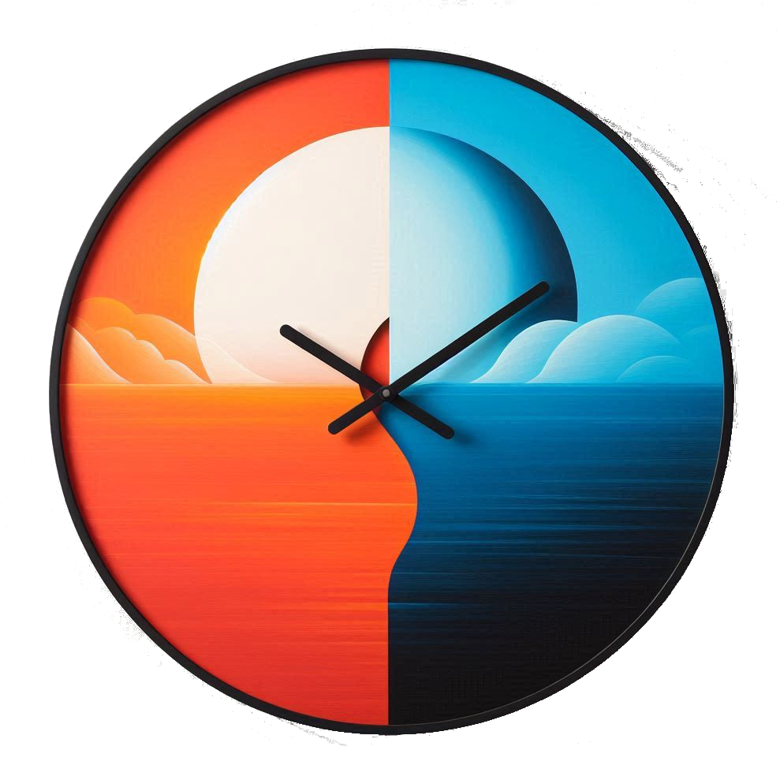

<div align="center" id="top"> 
  

  &#xa0;

<a href="http://www.sounaks.com">Sounak Software</a>
</div>

<h1 align="center">DeskStop</h1>

<p align="center">
  

  

  

  

  

  

  
</p>

<hr>

<p align="center">
  <a href="#dart-about">About</a> &#xa0; | &#xa0; 
  <a href="#sparkles-features">Features</a> &#xa0; | &#xa0;
  <a href="#rocket-technologies">Technologies</a> &#xa0; | &#xa0;
  <a href="#white_check_mark-requirements">Requirements</a> &#xa0; | &#xa0;
  <a href="#checkered_flag-starting">Starting</a> &#xa0; | &#xa0;
  <a href="#memo-license">License</a> &#xa0; | &#xa0;
  <a href="https://github.com/sounak3" target="_blank">Author</a>
</p>

<br>

## :dart: About ##

DeskStop is a versatile, multi-feature clock and timer application designed for desktop use across Windows, Linux, and macOS platforms. With a range of customizable features, DeskStop is ideal for users who want a personalized, functional time-keeping and productivity tool with visual appeal. The application combines utility and aesthetic customization to enhance user experience.

## :sparkles: Features ##

:heavy_check_mark: **`Uptime Tracker:`** Monitor your system’s uptime to gauge productivity or device longevity;\
:heavy_check_mark: **`Analog & Digital Clocks:`** Choose between classic analog or modern digital displays to suit your style;\
:heavy_check_mark: **`Multiple Time Zones:`** View and manage time across multiple regions—ideal for remote teams and frequent travelers;\
:heavy_check_mark: **`Pomodoro Timer:`** Integrated Pomodoro timer to boost productivity with customizable work and break intervals;\
:heavy_check_mark: **`Customizable UI:`** Personalize DeskStop’s look with a range user interface settings like font, Background Color & Opacity to blend with your desktop environment;\
:heavy_check_mark: **`Various Dial Images:`** Select from different dial styles for the analog clock, adding a unique touch to your time display;\
:heavy_check_mark: **`Alarms:`** Set one-time or recurring alarms with custom tones for reminders, tasks, or events;\
:heavy_check_mark: **`Pomodoro Sounds:`** Choose from various sound effects for the Pomodoro timer to suit your work rhythm;

## :rocket: Technologies ##

The following tools were used in this project:


- [Java](https://openjdk.org/)
- [Maven](https://maven.apache.org/index.html)
- [Git](https://git-scm.com/)
- [VSCode](https://code.visualstudio.com/)

## :white_check_mark: Requirements ##

Before starting :checkered_flag:, you need to have:
- This is a GUI desktop application. Hence, should be run in Windows / Linux / MacOS GUI desktop environment.

In case you're cloning this repository and running:
- Need to have [Git](https://git-scm.com) and [Java SDK](https://openjdk.org/install/) installed.

In case you're installing from releases, please download the appropriate OS package and install:

|  OS  | Download file | MD5 hash |
| ---  | ------------- | -------- |
| Windows | [DeskStop-1.0.msi](https://github.com/sounak3/desktime/releases/latest/download/DeskStop-1.0.msi) | 1b258bdd3c937c19e7ce364eaade5422 |
| Ubuntu / Debian | [deskstop_1.0-release_amd64.deb](https://github.com/sounak3/desktime/releases/latest/download/deskstop_1.0-release_amd64.deb) | e3c96c6069815efa179943b6b3cd5f49 |
| Mac OS | [DeskStop-1.0.dmg](https://github.com/sounak3/desktime/releases/latest/download/DeskStop-1.0.dmg) | c76b8c515bf5d3b12229d4c6bef311f0 |

## :checkered_flag: Starting ##

In case you've installed from releases:
- Ubuntu: Click DeskStop under Main/Start Menu --> Office sub-menu
- Windows: Click DeskStop in Start menu
- Mac OS: Clock DeskStop in Launcher

In case you're cloning this repository and running:
```bash
# Clone this project
$ git clone https://github.com/sounak3/desktime

# Access
$ cd desktime

# Run the project
$ java -jar desktime.jar

```

## :memo: License ##

This project is under license from MIT. For more details, see the [LICENSE](LICENSE.md) file.


Made with :heart: by <a href="https://github.com/sounak3" target="_blank">Sounak Choudhury</a>

&#xa0;

<a href="#top">Back to top</a>
